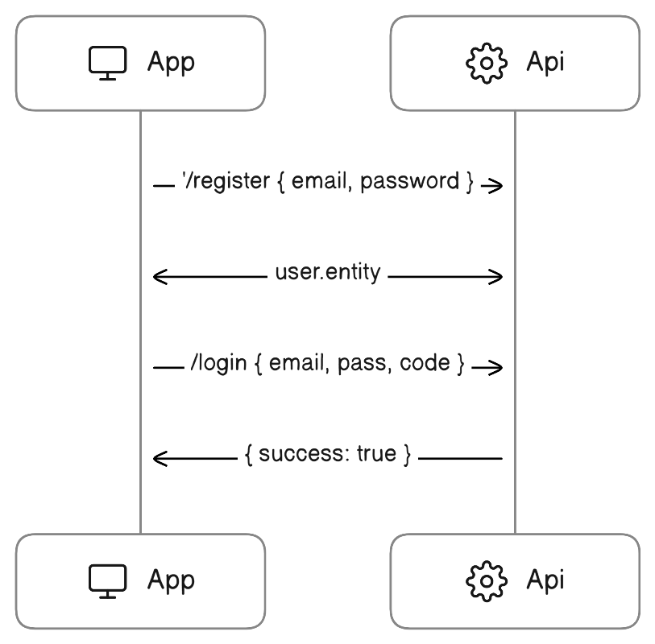

# Auth Flow




### Register

Request
```bash
POST http://{{host}}:{{port}}/api/auth/register
Content-Type: application/json

{
    "email": "info@usmedia.nl",
    "password": "HASHME"
}

```

Response
```json
{
  "user": {
    "id": "fd460112-1bf1-4ecb-b1c0-4f946b9477d2",
    "email": "info2@usmedia.nl",
    "emailVerified": false,
    "twoFactorEnabled": false,
    "_links": {
      "self": {
        "href": "http://localhost:3000/api/users/fd460112-1bf1-4ecb-b1c0-4f946b9477d2"
      }
    }
  }
}
```


### Login

Request
```
POST http://{{host}}:{{port}}/api/auth/login
Content-Type: application/json

{
    "email": "info@usmedia.nl",
    "password": "HASHME",
    "emailVerificationCode": "ZRR9QP"
}
```

Response
```json
Set-Cookie: GIZ-COOKIE=s%3A31b7b3f9-9b6f-49c2-b984-9e53a3ead

{
  "success": true
}
```

# API Responses

Entity
```json
{
  "simulation": {
    "id": "6d39470b-f922-4f57-bace-34ac2eeed8f8",
    "year": "2031",
    ...
    "createdAt": "2024-03-28T12:18:55.077Z",
    "updatedAt": "2024-03-28T12:18:55.077Z",
    "_links": {
      "self": {
        "href": "http://localhost:3000/api/simulations/6d39470b-f922-4f57-bace-34ac2eeed8f8"
      },
      "workers": {
        "href": "http://localhost:3000/api/simulations/6d39470b-f922-4f57-bace-34ac2eeed8f8/workers"
      }
    }
  }
}
```

Success
```json
{
  "success": true
}
```

```json
{
  "resetEmailSent": true
}
```
```json
{
  "passwordReset": true
}
```

# Routes

- App Engine serves single html (lang=en)
- Angular handles all routing

```
{
    '/': {
        # This redirects to routes below based on browser language
    }
    '/en': {
        '/dashboard',
        ...
    }
    '/es': {
        '/panel',
        ...
    }
}
```

# Angular Query 

https://bitbucket.org/usmedia/giz-costing-tool-app/pull-requests/8